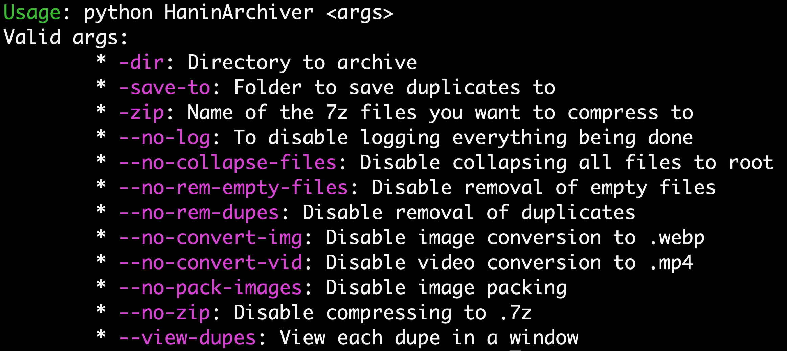
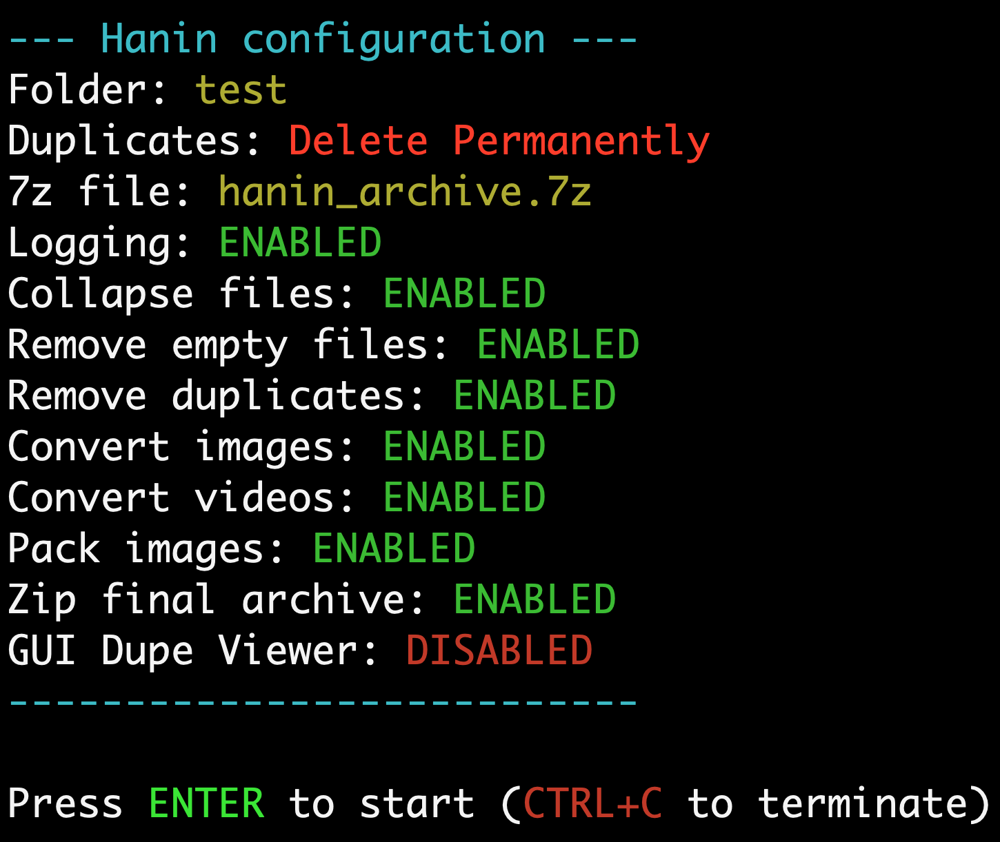

# اَلسَلامُ عَلَيْكُم وَرَحْمَةُ اَللهِ وَبَرَكاتُهُ

I suck at introductions. I am a high school student (12th grade), I love programming for some reason, and I am illiterate in Assembly and French. I started programming when I was around seven or eight in Python, slowly learned lower level languages, like JavaScript *(very low indeed)*, Java, etc., but only up to C++.

## My Projects

```cpp
#define occasionally never
```

I have built plenty of projects throughout the years, but I haven't published them for various reasons: unpolished code, old and trashy code, no documentation, etc. Over the years, I have learned to write cleaner programs, and I am currently going through my old projects to rewrite them and document them so I can publish them properly. Many of the projects have pending features I want to implement, which just get stored in a `TODO` file, and occasionally get done.

### 1. Farix

This project is currently unfinished, but is one of my favourites. It's basically an operating system that I am building using C++, and I have too many plans for it. Eventually, it will be finished, but I lack the time to finish it off.

### 2. HaninArchiver

<div style="float: right; margin-left: 15px;">
  <br>
  
</div>

A small Python project to clean up a hard disk full of pictures and videos entirely through a terminal application. I had some more ideas for it, but exams got in the way, and I lost interest. Maybe one day I'll get interested in it again.

As of now, it deletes exact duplicate files, converts images and videos to a more modern format for compression purposes, and optionally compresses them into a 7z archive at the end. Every single optimization can be toggled on and off from the initial terminal command.

### 3. DryLab++

<div style="float: right; margin-left: 15px;">
  <br>
</div>

Chemistry was boring to study, so I decided it would be fun to infuse my love for programming with my confusion about chemistry. The number of emails and questions I sent to my chemistry teacher should be studied.

It should be noted, that I have no clue if this program genuinely works or not. As far as my knowledge extends, it *seems* to be working, and I am not entirely sure of the deeper chemistry stuff to know for sure.

### 4. IdeaStack

A very shoddy Python project built so terribly I didn't even bother cleaning it up. It works, and that's all that matters, as all it does is store the ideas I get in a nice concise format that I can easily re-access and use and write into, so that I can visually arrange the future of my projects. This one was incredibly useful for every program I built after it, because I find it much nicer to structure my to-do list into it than just typing it into a `TODO` file. 

## Contact

no.